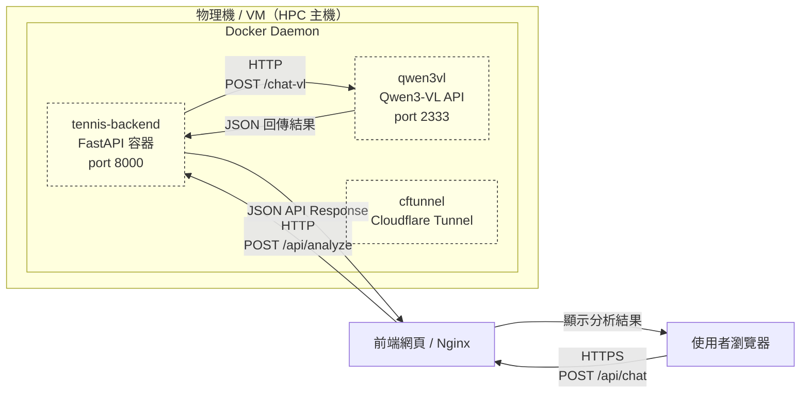

## 重要!!!!
有換模型的話直接放到雲端然後改main.sh的對應檔名跟連結!!!!!
https://drive.google.com/drive/folders/1ttI0QDaQ6rkU-6uh9F-09ewdqgxi_HqU?usp=drive_link
增加測試影片也是

網球資料集
https://universe.roboflow.com/viren-dhanwani/tennis-ball-detection/dataset/6

## 檔案架構
```sh
TennisProject/
├── input/ # 輸入影片
├── model/ # 訓練好的模型
│ ├── ball/
│ ├── court/
│ ├── bounce/
├── src/ # 主要程式
│ ├──
│ ├──
│ ├──
├── main.py
├── main.sh
├── static/ # llm前端
│ ├──index.html
├── app.py # llm後端
├── src_llm #llm可調用的函式
├── llm_server/ #llm伺服器暫存
│ ├── uploads/
│ ├── outputs/
├── .gitignore
```

## docker
在主目錄下Build Dockerfile
```
cd ~/TennisProject
docker build -f docker/Dockerfile -t tennis:latest .
```
Run Container
```
docker run --gpus all -it --rm \
  -v ~/TennisProject:/workspace \
  -p 8000:8000 \
  tennis:latest /bin/bash
```


## llm

啟動
``` uvicorn app:app --host 0.0.0.0 --port 8000 --reload ```

ollama部份現在是直接呼叫我本機220.132.170.233的，所以如果是用llama3.1就不用再自己裝

## 筆記
markdown preview快捷鍵 ctrl-shift-v


